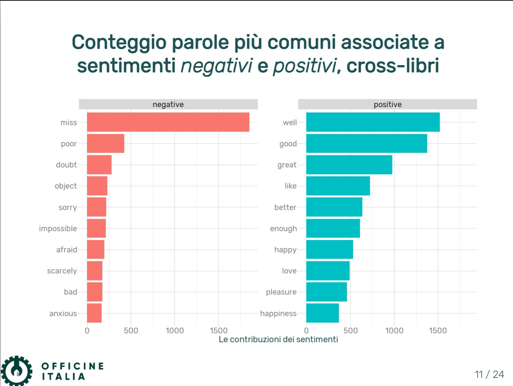

<!-- README.md is generated from README.Rmd. Please edit that file -->

# Pitch [Officine Italia](https://www.officineitalia.org/)

*author*: **[Niccolò Salvini](https://niccolosalvini.netlify.app/)**
*date*: 30 gennaio, 2021

   

### Deployment:

Slides are served with [Netlify](https://www.netlify.com/) and can be
found in the upper right corner of the GitHUb page ore directly at
[textmining.netlify.app](https://textmining.netlify.app)

### Description:

These slides have been composed to orient stakeholders giving a
perspective on the effectiveness of the R language through its Text
Mining libraries (`Tidytext` and `Tidyverse` stack, `ggplot2` visulaz )
as well as giving an intuition on its graphical possibilities. They are
written in Italian.

### License:

 Quest’opera
è distribuita con Licenza
<a rel="license" href="http://creativecommons.org/licenses/by/4.0/">Creative
Commons Attribuzione 4.0 Internazionale</a>.
