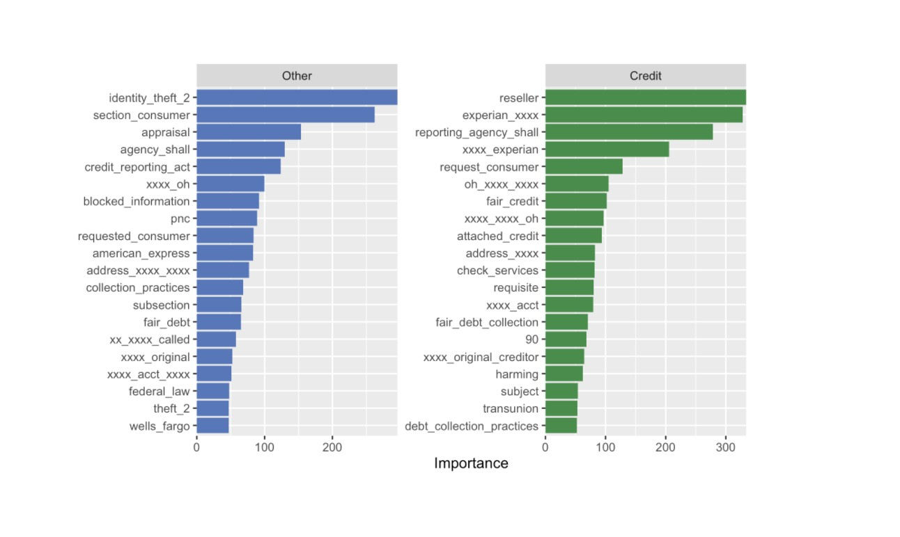
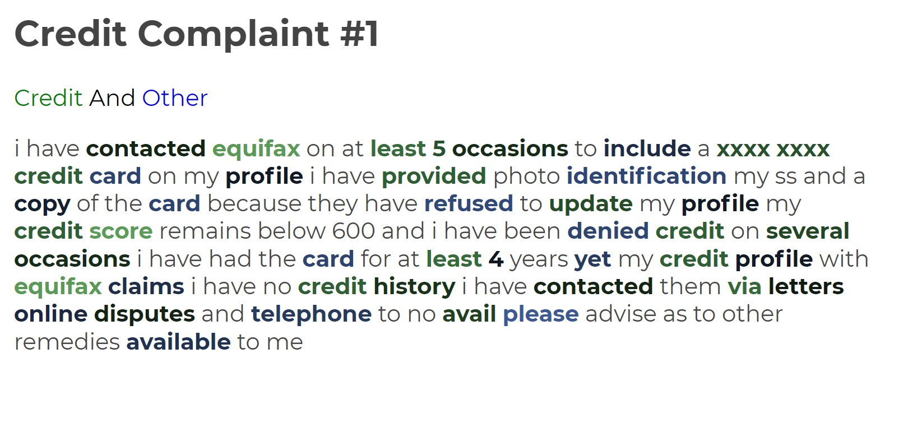
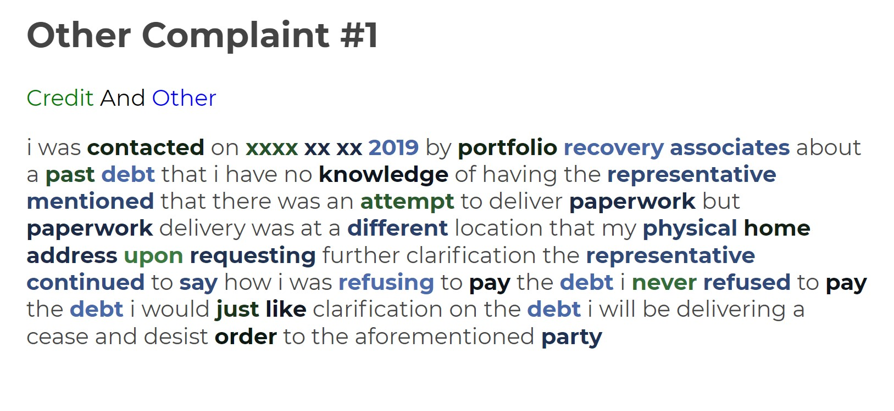

background-image: url(img/oi-logo.png)
background-size: contain

```{r setup, include=FALSE}
options(htmltools.dir.version = FALSE)
knitr::opts_chunk$set(echo = F,
                        fig.width = 7,
                      fig.align = 'center',
                      fig.asp = 0.618, # 1 / phi
                      out.width = "700px",
                      fig.retina = 3, 
                      warning = F,
                      message = F)


library(tidyverse, quietly = T, warn.conflicts = F)
library(tidytuesdayR, quietly = T, warn.conflicts = F)
library(scales, quietly = T, warn.conflicts = F)
library(topicmodels, quietly = T, warn.conflicts = F)
library(tidytext, quietly = T, warn.conflicts = F)
library(lubridate, quietly = T, warn.conflicts = F)
library(wordcloud, quietly = T, warn.conflicts = F)
library(reshape2, quietly = T, warn.conflicts = F)
library(tidylo, quietly = T, warn.conflicts = F)
library(magick, quietly = T, warn.conflicts = F)
library(tidyr, quietly = T, warn.conflicts = F)
library(textdata, quietly = T, warn.conflicts = F)
library(DT, quietly = T, warn.conflicts = F)
library(janeaustenr, quietly = T, warn.conflicts = F)
library(igraph, quietly = F)
library(ggraph, quietly = F)
library(reactable, quietly = T, warn.conflicts = F)
library(purrrlyr, quietly = T, warn.conflicts = F)
library(formattable, quietly = T, warn.conflicts = F)
library(conflicted, quietly = T, warn.conflicts = F)


## xaringan theme --> generates CSS
library(xaringanthemer, quietly = T, warn.conflicts = F)
library(showtext, quietly = T, warn.conflicts = F)

## manage conflicts
conflict_prefer("filter", "dplyr")
conflict_prefer("crossing", "tidyr")


# 
# custom _Officine Italia_ theme

#Define gppr_theme() function
# 
# theme_oi = function(){ 
#     font = "Georgia"   #assign font family up front
#     
#     theme_minimal() %+replace%    #replace elements we want to change
#     
#     theme(
#       
#       #grid elements
#       panel.grid.major = element_blank(),    #strip major gridlines
#       panel.grid.minor = element_blank(),    #strip minor gridlines
#       axis.ticks = element_blank(),          #strip axis ticks
#       
#       #since theme_minimal() already strips axis lines, 
#       #we don't need to do that again
#       
#       #text elements
#       plot.title = element_text(             #title
#                    family = font,            #set font family
#                    size = 20,                #set font size
#                    face = 'bold',            #bold typeface
#                    hjust = 0,                #left align
#                    vjust = 2),               #raise slightly
#       
#       plot.subtitle = element_text(          #subtitle
#                    family = font,            #font family
#                    size = 14),               #font size
#       
#       plot.caption = element_text(           #caption
#                    family = font,            #font family
#                    size = 9,                 #font size
#                    hjust = 1),               #right align
#       
#       axis.title = element_text(             #axis titles
#                    family = font,            #font family
#                    size = 10),               #font size
#       
#       axis.text = element_text(              #axis text
#                    family = font,            #axis famuly
#                    size = 9),                #font size
#       
#       axis.text.x = element_text(            #margin for axis text
#                     margin=margin(5, b = 10))
#       
#       #since the legend often requires manual tweaking 
#       #based on plot content, don't define it here
#     )
# }
# logo = image_read("img/oi-logo.png")
# grid::grid.raster(logo, x = 0.09, y = 0, just = c('left', 'bottom'), width = unit(2, 'inches'))


```

```{r xaringan-themer, include=FALSE, warning=FALSE}

style_mono_accent(
  base_color = "#1c5253",
  header_font_google = google_font("Rubik"),
  text_font_google   = google_font("Rubik", "300", "300i"),
  code_font_google   = google_font("Fira Mono")
)

```


???

Image credit: [Officine Italia logo](https://images.squarespace-cdn.com/content/5e89b9646da6496e27deb3d5/1586882637764-QZHOK9GWFWMJ4TXC1KKZ/oi-logo-test-2-02.png?content-type=image%2Fpng)

---
background-image: url(img/oi-logo.png)
background-position: 0% 100%
background-size: 20%

# Disclaimers

- Il tema delle slides (colore e font), come i loghi delle immagini possono essere cambiati tramite semplice aggiunta di *CSS*, per ora sono autogenerati e solamente adattati nel colore e nella tipologia dei font tramite il pacchetto `xaringanthemer` 

--

- I seguenti grafici e pezzi di codice sono basati sulla documentazione orginale della libreria `Tidytext` e il progetto Open Source [tidytuesday](https://www.tidytuesday.com/) a cura di [David Robinson](https://github.com/dgrtwo/data-screencasts) e [Julia Silge](https://juliasilge.com/). Inoltre è utilizzata una stack di librerie (in R) legate agli autori dell'analisi e all'universo `{Tidyverse}`

--

- I datasets su cui sono fatti correre i codici sono resi pubblici ai seguenti indirizzi [Repo 1](https://raw.githubusercontent.com/rfordatascience/tidytuesday/master/data/2020/2020-09-29/beyonce_lyrics.csv), [Repo 2](https://raw.githubusercontent.com/rfordatascience/tidytuesday/master/data/2020/2020-09-29/taylor_swift_lyrics.csv), libri di Jane Austen 

--

- **NUOVO**

- Nella seconda parte guardiamo un po' di Text Machine Learning sul dataset **C**onsumer **C**omplaint **D**atabase (di [CFPB](https://www.consumerfinance.gov/data-research/consumer-complaints/) Consumer Financial Protection Bureau). Il pezzo di database contiene dei complaints su prodotti e servizi finanziari (Americani). I clienti mandano il complaint all'intermediario CFPB e successivamente questo glieli gira all'azienda per risposta. Quando la relazione tra cliente e azienda e nesso causale viene confermata, CFPB pubblica il complaint.

---
background-image: url(img/oi-logo.png)
background-position: 0% 100%
background-size: 20%

# Presenter Notes (keyboard shortcuts)

.pull-left[
- `h`: Help

- `c`: Copy to new window

- `p`: **Presenter mode** (premilo se devi presentare)

- `m`: Mirror

- `f`: Full screen

- `b`: Black out

- `t`: Start/stop timer

- `num + enter`: Nav to page `num`
]

---
class: inverse, center, middle

# Sentiment Analysis

```{r loaddata}
beyonce_lyrics = readr::read_csv('https://raw.githubusercontent.com/rfordatascience/tidytuesday/master/data/2020/2020-09-29/beyonce_lyrics.csv')
taylor_swift_lyrics = readr::read_csv('https://raw.githubusercontent.com/rfordatascience/tidytuesday/master/data/2020/2020-09-29/taylor_swift_lyrics.csv')
sales = readr::read_csv('https://raw.githubusercontent.com/rfordatascience/tidytuesday/master/data/2020/2020-09-29/sales.csv')
charts = readr::read_csv('https://raw.githubusercontent.com/rfordatascience/tidytuesday/master/data/2020/2020-09-29/charts.csv')


tidy_books = austen_books() %>%
  group_by(book) %>%
  mutate(
    linenumber = row_number(),
    chapter = cumsum(str_detect(text, 
                                regex("^chapter [\\divxlc]", 
                                      ignore_case = TRUE)))) %>%
  ungroup() %>%
  unnest_tokens(word, text)

```

---
background-image: url(img/oi-logo.png)
background-position: 0% 100%
background-size: 20%
# Jane Austen Books

--

.left-column[
###  Research Question:
]


--

.right-column[
Quali sono le parole associate a sentimenti "**buoni**" (=joy equivalent) o "**cattivi**" nei Romanzi di [Jane Austen](https://it.wikipedia.org/wiki/Jane_Austen)?

- Sense and Sensibility 
- pride adn prejudice 
- Mansfield park
- Emma 
- narthanger abbey
- Persuasion

]

---
## Workflow Sentiment Analysis
Il testo per ogni libro subisce una serie di passaggi (scatole nere) secondo cui:

--

- Vengono **tokenizzati**, cioè ogni parola viene divisa dalla successiva

--

- Viene preso un **dizionario di sentimento** (ex. NRC) che raccoglie tutte le parole e i relativi sentimenti associati alla parola

--

- Vengono riarrangati con un **ordine** (grandezza di conteggio per esempio)

--

- Vengono **Visualizzati**


---
background-image: url(img/oi-logo.png)
background-position: 0% 100%
background-size: 20%
class: center, middledw
##  Visualizzati con Tabelle Interattive...

Sentiment è un punteggio che assegna uno score al sentimento (joinando ogni parola ad un suo score tramite il dizionario "Bing lexicon") ed è la differenza tra sentimento positivo e sentimento negativo.

```{r sentbuoni}


nrc_joy = get_sentiments("nrc") %>% 
  filter(sentiment == "joy")

jane_austen_sentiment <- tidy_books %>%
  inner_join(get_sentiments("bing")) %>%
  count(book, index = linenumber %/% 80, sentiment) %>%
  spread(sentiment, n, fill = 0) %>%
  mutate(sentiment = positive - negative)
jane_austen_sentiment %>% 
  head(50) %>%
  reactable(searchable = TRUE,
            minRows = 8,
            striped = TRUE,
            bordered = TRUE,
            theme = reactableTheme(
    stripedColor = "#1c5253",
    highlightColor = "#1c5253",
    cellPadding = "8px 12px",
    style = list(fontFamily = "-apple-system, BlinkMacSystemFont, Segoe UI, Helvetica, Arial, sans-serif"),
    searchInputStyle = list(width = "100%")
  ))

  
```

---
### Visualizzati con Grafici Statici...
Puoi immaginarti questo su **diversi documenti** per più paesi comparativamente. Index tiene traccia della parte del libro (sezione) dove si è (80 linee di testo per segmento).

```{r jasent}
ggplot(jane_austen_sentiment, aes(index, sentiment, fill = book)) +
  geom_col(show.legend = FALSE) +
  facet_wrap(~book, ncol = 2, scales = "free_x")+
  theme_xaringan(background_color = "#FFFFFF")
```
---
```{r jasent2, out.width='100%'}
library(plotly, quietly = T, warn.conflicts = F)
p = ggplot(jane_austen_sentiment, aes(index, sentiment, fill = book)) +
  geom_col(show.legend = FALSE) +
  facet_wrap(~book, ncol = 2, scales = "free_x")+
  ggtitle(label = "O Grafici Dinamici")+
  theme_xaringan(background_color = "#FFFFFF")
ggplotly(p) %>%
  hide_legend()
```


---
background-image: url(img/oi-logo.png)
background-position: 0% 100%
background-size: 20%
class: center, middledw
### Conteggio parole più comuni associate a sentimenti *negativi* e *positivi*, cross-libri

```{r bencounts}
bing_word_counts <- tidy_books %>%
  inner_join(get_sentiments("bing")) %>%
  count(word, sentiment, sort = TRUE) %>%
  ungroup()
bing_word_counts %>%
  group_by(sentiment) %>%
  top_n(10) %>%
  ungroup() %>%
  mutate(word = reorder(word, n)) %>%
  ggplot(aes(n, word, fill = sentiment)) +
  geom_col(show.legend = FALSE) +
  facet_wrap(~sentiment, scales = "free_y") +
  labs(x = "Le contribuzioni dei sentimenti",
       y = NULL) +
  theme_xaringan(background_color = "#FFFFFF")

```


---
background-image: url(img/oi-logo.png)
background-position: 0% 100%
background-size: 20%


```{r wordcloud}
tidy_books %>%
  inner_join(get_sentiments("bing")) %>%
  count(word, sentiment, sort = TRUE) %>%
  acast(word ~ sentiment, value.var = "n", fill = 0) %>%
  comparison.cloud(colors = c("blue", "#1c5253"),
                   max.words = 100)
```

---
class: inverse, center, middle

# tf-idf Term Frequency (tf) - Inverse Document Frequency (idf),


---
background-image: url(img/oi-logo.png)
background-position: 0% 100%
background-size: 20%
###  Due parole su [tf-idf](https://it.wikipedia.org/wiki/Tf-idf)...

"The statistic *tf-idf* is intended to measure how important a word is to a document in a collection (or corpus) of documents, for example, to one novel in a collection of novels or to one website in a collection of websites.
The idea of tf-idf is to find the important words for the content of each document by decreasing the weight for commonly used words and increasing the weight for words that are not used very much in a collection or corpus of documents, in this case, the group of Jane Austen’s novels as a whole."

```{r ex}
book_words <- austen_books() %>%
  unnest_tokens(word, text) %>%
  count(book, word, sort = TRUE)

book_tf_idf <- book_words %>%
  bind_tf_idf(word, book, n)

book_tf_idf %>% 
  head(30)  %>% 
  reactable(searchable = TRUE,
            minRows = 8,
            theme = reactableTheme(
    borderColor = "#1c5253",
    stripedColor = "#1c5253",
    highlightColor = "#1c5253",
    cellPadding = "8px 12px",
    style = list(fontFamily = "-apple-system, BlinkMacSystemFont, Segoe UI, Helvetica, Arial, sans-serif"),
    searchInputStyle = list(width = "100%")
  ))
```

---
background-image: url(img/oi-logo.png)
background-position: 0% 100%
background-size: 20%
## td-idf score per parola-docs
```{r tfidf}
book_tf_idf <- book_words %>%
  bind_tf_idf(word, book, n)

book_tf_idf %>%
  group_by(book) %>%
  slice_max(tf_idf, n = 15) %>%
  ungroup() %>%
  ggplot(aes(tf_idf, fct_reorder(word, tf_idf), fill = book)) +
  geom_col(show.legend = FALSE) +
  facet_wrap(~book, ncol = 2, scales = "free") +
  labs(x = "tf-idf score", y = NULL) +
  theme_xaringan(background_color = "#FFFFFF")
  
```
---
class: inverse, center, middle

# Relazioni tra Parole e correlazioni, "n-grams"

---
###  Qualcosa su [n-gram](https://it.wikipedia.org/wiki/N-gramma)

"Many interesting text analyses are based on the relationships between words, whether examining which words tend to follow others immediately, or that tend to co-occur within the same documents [...]
This includes tokenizing (punto A, slide 7 ) with token = "ngrams" argument, which tokenizes by pairs of adjacent words rather than by individual ones" 
In questo caso **Bigrams** (si può fare anche **Trigrams** (dove $n = 3$ numero di parole):

```{r bigrams}
austen_bigrams <- austen_books() %>%
  unnest_tokens(bigram, text, token = "ngrams", n = 2)
bigrams_separated <- austen_bigrams %>%
  separate(bigram, c("word1", "word2"), sep = " ")

bigrams_filtered <- bigrams_separated %>%
  filter(!word1 %in% stop_words$word) %>%
  filter(!word2 %in% stop_words$word)

# new bigram counts:
bigram_counts <- bigrams_filtered %>% 
  count(word1, word2, sort = TRUE)

bigrams_united <- bigrams_filtered %>%
  unite(bigram, word1, word2, sep = " ")

bigrams_united %>% 
  head(30) %>% 
    reactable(searchable = TRUE,
            minRows = 8,
            theme = reactableTheme(
    borderColor = "#1c5253",
    stripedColor = "#1c5253",
    highlightColor = "#1c5253",
    cellPadding = "8px 12px",
    style = list(fontFamily = "-apple-system, BlinkMacSystemFont, Segoe UI, Helvetica, Arial, sans-serif"),
    searchInputStyle = list(width = "100%")
  ))
  
```
---
## Combini il bigram con il tf-idf
Consideri il bigramma come se fosse una parola sola e la tratti con tf-idf. Facendo questo eviti le parole che per sintassi e grammatica stanno sempre insieme come verbi fraseologici etc.)
```{r nbigram}
bigram_tf_idf <- bigrams_united %>%
  count(book, bigram) %>%
  bind_tf_idf(bigram, book, n) %>%
  arrange(desc(tf_idf))

bigram_tf_idf %>%
  arrange(desc(tf_idf)) %>%
  group_by(book) %>%
  slice_max(tf_idf, n = 10) %>%
  ungroup() %>%
  mutate(bigram = reorder(bigram, tf_idf)) %>%
  ggplot(aes(tf_idf, bigram, fill = book)) +
  geom_col(show.legend = FALSE) +
  facet_wrap(~ book, ncol = 2, scales = "free") +
  labs(x = "tf-idf di un bigramma", y = NULL) +
  theme_xaringan(background_color = "#FFFFFF")
```
---
### ... E riapplichi i concetti della **Sentiment**

In questo specifico caso vai a esplorare una disambiguazione comune associata alla parola "not" in inglese. Se avessimo fatto una sentiment e avessimo trovato la parola "happy" nel documento, allora il sentiment associato al documento sarebbe stato positivo. Tuttavia quando la parola è preceduta da **not** in realtà comunica l'esatto opposto. Quindi esamino le parole più comuni sia accostate ad un sentimento e anche precedute dalla parola "not":
```{r afinn}
AFINN <- get_sentiments("afinn")

bigrams_separated <- austen_bigrams %>%
  separate(bigram, c("word1", "word2"), sep = " ")

not_words <- bigrams_separated %>%
  filter(word1 == "not") %>%
  inner_join(AFINN, by = c(word2 = "word")) %>%
  count(word2, value, sort = TRUE)
not_words %>%
  mutate(contribution = n * value) %>%
  arrange(desc(abs(contribution))) %>%
  head(20) %>%
  mutate(word2 = reorder(word2, contribution)) %>%
  ggplot(aes(n * value, word2, fill = n * value > 0)) +
  geom_col(show.legend = FALSE) +
  labs(x = "Valore del sentimento * # di volte che compare",
       y = "Parole precedute da \"not\"") +
  theme_xaringan(background_color = "#FFFFFF")

```

---
## Visualizzare **Network** di bigrammi

Possiamo anche essere interessati a visualizzare le relazioni tra parole simultaneamente, anzichè qualcuna in cima ad una lista: 
```{r net}

bigram_graph <- bigram_counts %>%
  filter(n > 20) %>%
  graph_from_data_frame()

## setta seed
set.seed(2021)
a <- grid::arrow(type = "closed", length = unit(.15, "inches"))

ggraph(bigram_graph, layout = "fr") +
  geom_edge_link(aes(edge_alpha = n), show.legend = FALSE,
                 arrow = a, end_cap = circle(.07, 'inches')) +
  geom_node_point(color = "lightblue", size = 5) +
  geom_node_text(aes(label = name), vjust = 1, hjust = 1) +
  theme_void()

```

---
class: inverse, center, middle

# Topic Modeling

---
background-image: url(img/oi-logo.png)
background-position: 0% 100%
background-size: 20%

## Due parole sul Topic Modeling

"In text mining, we often have collections of documents, such as blog posts or news articles, that we’d like to divide into **natural groups** so that we can understand them separately. Topic modeling is a method for **unsupervised classification** of such documents, **similar to clustering** on numeric data, which finds natural groups of items even when we’re not sure what we’re looking for."

--

Ci sono diversi modelli che tirano fuori i Topics da stringhe di testo, quello più popolare è **LDA**. La teoria qui diventa un po' più pesante e la assumo.

--

I Dati in questo caso vengono da "AssociatedPress" e sono una collezione di 2246 articoli di un' agenzia americana. Il modello associa ad ogni parola uno score che indica la probabilità che quella stessa parola provenga un tema $T$, dati un numero di temi decisi dall'utente. Qui presumo $T = 2$ . 

```{r loaddare}

data("AssociatedPress")
## fitting model
ap_lda <- LDA(AssociatedPress, k = 2, control = list(seed = 1234))
ap_topics <- tidy(ap_lda, matrix = "beta")
```

### I Risultati...

---
background-image: url(img/oi-logo.png)
background-position: 0% 100%
background-size: 20%

### Topic 1 e 2

Vedo le top 10 parole e posso desumere che il tema a SX riguarda **l'Economia-Finanza**, a DX **Politica**

```{r risu}
ap_top_terms <- ap_topics %>%
  group_by(topic) %>%
  top_n(10, beta) %>%
  ungroup() %>%
  arrange(topic, -beta)

ap_top_terms %>%
  mutate(term = reorder_within(term, beta, topic)) %>%
  ggplot(aes(beta, term, fill = factor(topic))) +
  geom_col(show.legend = FALSE) +
  facet_wrap(~ topic, scales = "free") +
  scale_y_reordered()+ 
  theme_xaringan(background_color = "#FFFFFF")
```

---
## ... Ma puoi anche fare cosi'

Puoi anche andare a vedere le differenze maggiori tra score di probabilità, chiamala $\beta$, tra le parole e andarle a comparare nuovamente i due topics. In questa maniera filtri sole le parole meno comuni, quindi quelle potenzialmente più pregne di significato.

```{r oddsratio}
beta_spread <- ap_topics %>%
  mutate(topic = paste0("topic", topic)) %>%
  spread(topic, beta) %>%
  filter(topic1 > .001 | topic2 > .001) %>%
  mutate(log_ratio = log2(topic2 / topic1))

beta_spread %>%
  group_by(direction = log_ratio > 0) %>%
  top_n(10, abs(log_ratio)) %>%
  ungroup() %>%
  mutate(term = reorder(term, log_ratio)) %>%
  ggplot(aes(log_ratio, term)) +
  geom_col() +
  labs(x = "Log2 odds ratio dei betas tra topic 2 / topic 1", y = NULL)+ 
  theme_xaringan(background_color = "#FFFFFF")
```
---
class: inverse, center, middle

# Network di Trigrammi
---

## Visualizza trigrams con connessioni

.footnote[
[1] source: [Emil Hvitfeldt](https://www.hvitfeldt.me/blog/visualizing-trigrams-with-the-tidyverse/)

]

```{r trigramprep}

# param set

n_word <- 20
n_top <- 150
n_gramming <- 3
 

## Trigrams 
trigrams <- tibble(text = janeaustenr::emma) %>%
  unnest_tokens(trigram, text, token = "ngrams", n = n_gramming)

start_words <- c("he", "she")

## top 150 trigrams using count and some regex magi
pattern <- str_c("^", start_words, " ", collapse = "|")

top_words <- trigrams %>%
  filter(str_detect(trigram, pattern)) %>%
  count(trigram, sort = TRUE) %>%
  slice(seq_len(n_top)) %>%
  pull(trigram)

trigrams <- trigrams %>%
  filter(trigram %in% top_words)


## trova i nodi
str_nth_word <- function(x, n, sep = " ") {
  str_split(x, pattern = " ") %>%
  map_chr(~ .x[n])
}

nodes <- map_df(seq_len(n_gramming),
       ~ trigrams %>%
           mutate(word = str_nth_word(trigram, .x)) %>%
           count(word, sort = TRUE) %>%
           slice(seq_len(n_word)) %>% 
           mutate(y = seq(from = n_word + 1, to = 0, 
                          length.out = n() + 2)[seq_len(n()) + 1],
                  x = .x))

## plot of node positions (check point)
# nodes %>% 
#   ggplot(aes(x, y, label = word))+
#   geom_text()

sigmoid <- function(x_from, x_to, y_from, y_to, scale = 5, n = 100) {
  x <- seq(-scale, scale, length = n)
  y <- exp(x) / (exp(x) + 1)
  tibble(x = (x + scale) / (scale * 2) * (x_to - x_from) + x_from,
         y = y * (y_to - y_from) + y_from)
}


egde_lines <- function(trigram, from_word, to_word, scale = 5, n = 50, 
                       x_space = 0) {

  from_word <- from_word %>%
    select(-n) %>%
    set_names(c("from", "y_from", "x_from"))
  
  to_word <- to_word %>%
    select(-n) %>%
    set_names(c("to", "y_to", "x_to"))
  
  links <- crossing(from = from_word$from, 
                    to = to_word$to) %>%
    mutate(word_pair = paste(from, to),
           number = map_dbl(word_pair, 
                            ~ sum(str_detect(trigram$trigram, .x)))) %>%
    left_join(from_word, by = "from") %>%
    left_join(to_word, by = "to")
  
  links %>%
    by_row(~ sigmoid(x_from = .x$x_from + 0.2 + x_space,
                     x_to = .x$x_to - 0.05, 
                     y_from = .x$y_from, y_to = .x$y_to, 
                     scale = scale, n = n) %>%
    mutate(word_pair = .x$word_pair,
           number = .x$number,
           from = .x$from)) %>%
    pull(.out) %>%
    bind_rows()
}
### check up edges 
### 
# egde_lines(trigram = trigrams, 
#            from_word = filter(nodes, x == 1), 
#            to_word = filter(nodes, x == 2)) %>%
#   filter(number > 0) %>%
#   ggplot(aes(x, y, group = word_pair, alpha = number, color = from)) +
#   geom_line()
#   


```

```{r calcedges}
# egdes between first and second column
egde1 <- egde_lines(trigram = trigrams, 
           from_word = filter(nodes, x == 1), 
           to_word = filter(nodes, x == 2), 
           n = 50) %>%
           filter(number > 0) %>%
  mutate(id = word_pair)

# Words in second colunm
## That start with he
second_word_he <- nodes %>%
  filter(x == 2) %>%
  select(-n) %>%
  left_join(
    trigrams %>% 
      filter(str_nth_word(trigram, 1) == start_words[1]) %>%
      mutate(word = str_nth_word(trigram, 2)) %>%
      count(word), 
    by = "word"
  ) %>%
  replace_na(list(n = 0))

## That start with she
second_word_she <- nodes %>%
  filter(x == 2) %>%
  select(-n) %>%
  left_join(
    trigrams %>% 
      filter(str_nth_word(trigram, 1) == start_words[2]) %>%
      mutate(word = str_nth_word(trigram, 2)) %>%
      count(word), 
    by = "word"
  ) %>%
  replace_na(list(n = 0))

# Words in third colunm
## That start with he
third_word_he <- nodes %>%
  filter(x == 3) %>%
  select(-n) %>%
  left_join(
    trigrams %>% 
      filter(str_nth_word(trigram, 1) == start_words[1]) %>%
      mutate(word = str_nth_word(trigram, 3)) %>%
      count(word), 
    by = "word"
  ) %>%
  replace_na(list(n = 0))

## That start with she
third_word_she <- nodes %>%
  filter(x == 3) %>%
  select(-n) %>%
  left_join(
    trigrams %>% 
      filter(str_nth_word(trigram, 1) == start_words[2]) %>%
      mutate(word = str_nth_word(trigram, 3)) %>%
      count(word), 
    by = "word"
  ) %>%
  replace_na(list(n = 0))

# egdes between second and third column that starts with he
egde2_he <- egde_lines(filter(trigrams, 
                              str_detect(trigram, paste0("^", start_words[1], " "))), 
             second_word_he, third_word_he, n = 50) %>%
  mutate(y = y + 0.05,
         from = start_words[1],
         id = str_c(from, word_pair, sep = " ")) %>%
  filter(number > 0)

# egdes between second and third column that starts with she
egde2_she <- egde_lines(filter(trigrams, 
                              str_detect(trigram, paste0("^", start_words[2], " "))), 
             second_word_she, third_word_she, n = 50) %>%
  mutate(y = y - 0.05,
         from = start_words[2],
         id = str_c(from, word_pair, sep = " ")) %>%
  filter(number > 0)

# All edges
edges <- bind_rows(egde1, egde2_he, egde2_she)

p <- nodes %>% 
  ggplot(aes(x, y, label = word, size = n)) +
  geom_text(hjust = 0, color = "white") +
  theme_void() +
  geom_line(data = edges,
            aes(x, y, group = id, color = from, alpha = sqrt(number)),
            inherit.aes = FALSE) +
  guides(alpha = "none", color = "none", size = "none") +
  xlim(c(0.9, 3.2)) +
  scale_size(range = c(3, 8)) +
  scale_color_manual(values = c("#5EF1F1", "red")) +
  theme(plot.background = element_rect(fill ="#1c5253", colour = 'black'),
        text = element_text(color = "#1c5253", size = 15))
p

```
---
class: inverse, center, middle

# Text Machine Learning `r emo::ji("rocket")`

---
background-image: url(img/oi-logo.png)
background-position: 0% 100%
background-size: 20%

## Il testo come Dati 

- Spesso viene o scartato o analizzato in separata sede come abbiamo fatto finora. Ma se si volesse integrare in un modello di regressione o classificazione?

--

.pull-left[

- "Sì, ma a che cosa mi serve un modello di Machine Learning per i miei dati di testo?"

]

--

.pull-left[

Ti serve perchè se il modello fosse allenato su un numero decente di testi allora potremmo costruire un classificatore binario.

]

--


.pull-left[

- "A cosa mi serve un classificatore binario?"

]

--

.pull-left[

Ti serve per esempio nel caso in cui tu voglia riconoscere se il documento parla di **Giovani** o no. Nell'esempio che ti porto vado a creare un classificatore per capire se si occupa di _Credit Reporting_ o di Altro [1]

]

.footnote[
[1] source: [Supervised Machine Learning for Text Analysis in R](https://smltar.com/mlclassification.html)

]


---
# Di che testo stiamo parlando

```{r load_complaints, echo=F}

complaints <- read_csv("data/complaints.csv.gz") %>% sample_frac(0.1)

```

-- 

.left-column[
...
ecco le prime parole per i primi 10 complaints

]

--

.right-column[

```{r, echo=F}
complaints %>%
  sample_n(10) %>%
  pull(consumer_complaint_narrative) %>% 
  str_trunc(50)
```
...

]


---
# Diamo un'occhiata...

```{r load_tidymodels}


library(tidymodels, quietly = T, warn.conflicts = F)
library(textrecipes, quietly = T, warn.conflicts = F)


complaints %>%
  mutate(product = str_wrap(product, 50),
         product = fct_rev(fct_infreq(factor(product)))) %>%
  ggplot(aes(y = product)) +
  geom_bar() +
  labs(x = NULL, y = NULL)


```


```{r, echo=F}
## Credit or not
credit <- "Credit reporting, credit repair services, or other personal consumer reports"
complaints2class <- complaints %>%
  mutate(product = factor(if_else(
    condition = product == credit, 
    true = "Credit", 
    false = "Other"))) %>%
  rename(text = consumer_complaint_narrative)
```

---
# Agenda


- Divido i dati per la _Cross Validation_ del modello (sistame di **resampling**)

--

- Feature Engineering su dati testo (la assumiamo)
  - tokenization, (già vista all'inizio delle slides)
  - togliamo le **Stop Words**. Quelle parole che non ci servono (ti ricordo l'esempio delle sottrazioni dei dizionari)
  - prego gli **n-gram** (già visti)
  - faccio **TF-IDF**
  
In pratica applico tutto quello che abbiamo visto prima ma con lo scopo di integrare quelle informazioni dentro un modello

--


- **Modelli** che funzionano su dati testo (solo alcuni)

--

- Costruiamo una **pipeline**[1] strutturata che integra il sistema di **resampling** , **Modelli** per tutta una **Griglia di Parametri**

--

- Seleziono modello migliore sulla base della metrica che scelgo (accuratezza della classificazione) ed ecco il mio **Classificatore** `r emo::ji("smile")`

.footnote[
pipeline con questo framework [Tidymodels](https://www.tidymodels.org/), in particolare questo [textrecipes](https://textrecipes.tidymodels.org/)
]

---
background-image: url(img/oi-logo.png)
background-position: 0% 100%
background-size: 20%

# Abbi pazienza ma cosa intendi per _Cross Validation_...

- divido i dati in 5 pezzi uguali (semplificato)

- su $\frac{4}{5}$ alleno il modello

- e il restante $\frac{1}{5}$ lo uso come test set, cioè uso i $\frac{4}{5}$ per prevedere quell' $\frac{1}{5}$ 

- questo lo faccio per tutti e 5 i pezzi - (nel nostro caso lo **spezziamo in 10 parti**) -

--

.center[
Vediamola per bene...
]

---
background-image: url(img/cv/Slide2.png)
background-size: contain

.footnote[
Art by [Alison Hill](https://alison.rbind.io/)
]
---
background-image: url(img/cv/Slide4.png)
background-size: contain

.footnote[
Art by [Alison Hill](https://alison.rbind.io/)
]
---
background-image: url(img/cv/Slide5.png)
background-size: contain

.footnote[
Art by [Alison Hill](https://alison.rbind.io/)
]
---
background-image: url(img/cv/Slide6.png)
background-size: contain

.footnote[
Art by [Alison Hill](https://alison.rbind.io/)
]
---
background-image: url(img/cv/Slide7.png)
background-size: contain

.footnote[
Art by [Alison Hill](https://alison.rbind.io/)
]
---
background-image: url(img/cv/Slide8.png)
background-size: contain

.footnote[
Art by [Alison Hill](https://alison.rbind.io/)
]
---
background-image: url(img/cv/Slide9.png)
background-size: contain

.footnote[
Art by [Alison Hill](https://alison.rbind.io/)
]
---
background-image: url(img/cv/Slide10.png)
background-size: contain

.footnote[
Art by [Alison Hill](https://alison.rbind.io/)
]


```{r data_splitting}

one_split <- slice(complaints2class, 1:30) %>% 
  initial_split() %>% 
  tidy() %>% 
  add_row(Row = 1:30, Data = "Original") %>% 
  mutate(Data = case_when(
    Data == "Analysis" ~ "Training",
    Data == "Assessment" ~ "Testing",
    TRUE ~ Data
  )) %>% 
  mutate(Data = factor(Data, levels = c("Original", "Training", "Testing")))

all_split <-
  ggplot(one_split, aes(x = Row, y = fct_rev(Data), fill = Data)) + 
  geom_tile(color = "white",
            size = 1) + 
  #scale_fill_manual(values = splits_pal, guide = FALSE) +
  theme_minimal() +
  theme(axis.text.y = element_text(size = rel(2)),
        axis.text.x = element_blank(),
        legend.position = "top",
        panel.grid = element_blank()) +
  coord_equal(ratio = 1) +
  labs(x = NULL, y = NULL)


set.seed(27)

complaints_split <- initial_split(complaints2class, strata = product)
complaints_train <- training(complaints_split)
complaints_test <- testing(complaints_split)

```

---
background-image: url(img/oi-logo.png)
background-position: 0% 100%
background-size: 20%

# Quali modelli lavorano bene su dati di testo?


- Support Vector Machines

- Naive Bayes

--

- Regularized Linear Models (glmnet) (*ci piazziamo questo*) 

---
background-image: url(img/oi-logo.png)
background-position: 0% 100%
background-size: 20%

# Specifichi Modello

specifichiamo questa formula: $product \sim date\_received + tags + text$

- *product* è se è credito o no

- *date_received* è la data di ricezione del claim 

- *tags* se sono state messe tags al claim 

- *text* il testo del claim

```{r ricetta, message=F}
library(quanteda)

complaints_rec <-
  recipe(product ~ date_received + tags + text,
    data = complaints_train
  ) %>%
  step_date(date_received, features = c("month", "dow"), role = "dates") %>%
  step_rm(date_received) %>%
  step_dummy(has_role("dates")) %>%
  step_unknown(tags) %>%
  step_dummy(tags) %>%
  step_tokenize(text) %>%
  step_stopwords(text) %>%
  step_ngram(text, num_tokens = 3, min_num_tokens = 1) %>%
  step_tokenfilter(text, max_tokens = tune(), min_times = 5) %>%
  step_tfidf(text)

### From natural language to ML features qui con tidytext
complaints_train %>%
  unnest_tokens(word, text) %>%
  anti_join(get_stopwords(), by = "word") %>%
  count(complaint_id, word) %>%
  bind_tf_idf(word, complaint_id, n) %>%
  cast_dfm(complaint_id, word, tf_idf)

```


```{r}
lasso_spec <- logistic_reg(penalty = tune(), mixture = 1) %>%
  set_mode("classification") %>%
  set_engine("glmnet")
lasso_spec
```


---
background-image: url(img/oi-logo.png)
background-position: 0% 100%
background-size: 20%

# Griglia di Parametri regolare 

.center[
specifico una griglia di parametri da provare al modello, magari becco la combinazione di parametri giusta

]

```{r}
param_grid <- grid_regular(
  penalty(range = c(-4, 0)),
  max_tokens(range = c(500, 2000)),
  levels = 6
)
## cross validarion folds
set.seed(27)
complaints_folds <- vfold_cv(complaints_train, v = 10, strata = product)

param_grid
```


---
background-image: url(img/oi-logo.png)
background-position: 0% 100%
background-size: 20%

# Creo la Pipeline e fitto il modello

```{r, echo = T}
complaints_wf <- workflow() %>%
  add_recipe(complaints_rec) %>%
  add_model(lasso_spec)

complaints_wf
```

--

```{r, eval=F}
set.seed(27)
lasso_rs <- tune_grid(
  complaints_wf,
  resamples = complaints_folds,
  grid = param_grid, 
  control = control_grid(save_pred = TRUE)
) 
```

---
background-image: url(img/oi-logo.png)
background-position: 0% 100%
background-size: 20%

# A questo punto?


Adesso posso:


.pull-left[

**Predire su nuovi documenti la classe di appartenenza (Credit contro Altro)**

]


--

.pull-right[

**Capire come ragiona il modello**

]


Per capire come ragiona il modello faccio una _Variable Importance_; task che mi permette di capire quali features (parole in questo caso) per il modello sono importanti per classificare il **complaint**

- Prossima slide le parole ritenute più importanti per classificare il **complaint** o *Credito* o *Altro*

- Successiva slide 1 esempio di complaint classificato come _Credito_ con le features che il modello ritiene importanti

- Dopo 1 esempio di complaint _Altro_ con le features che il modello ritiene importanti per classificarle come *Altro*


---

# Parole utili a differenziare **Credit** vs **Other**




---
## Credit Complaint #1




---

## Other Complaint #1




---